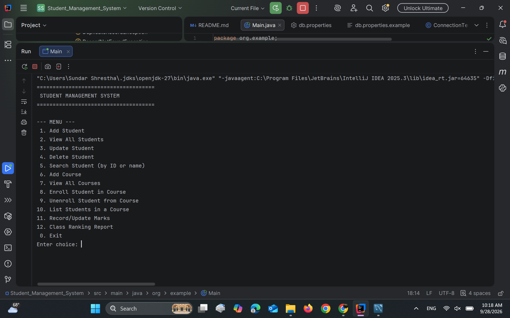
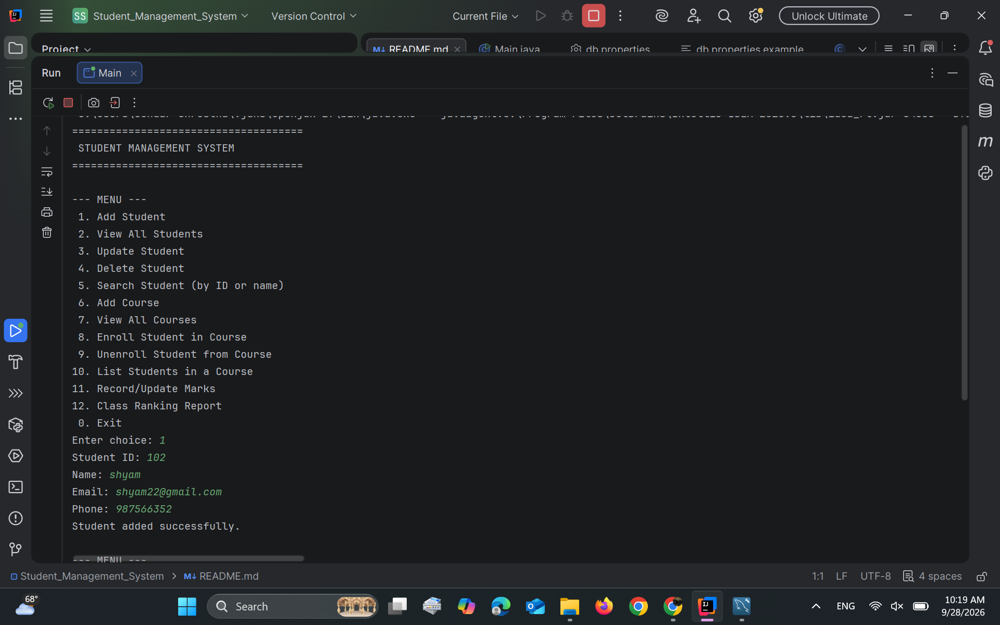
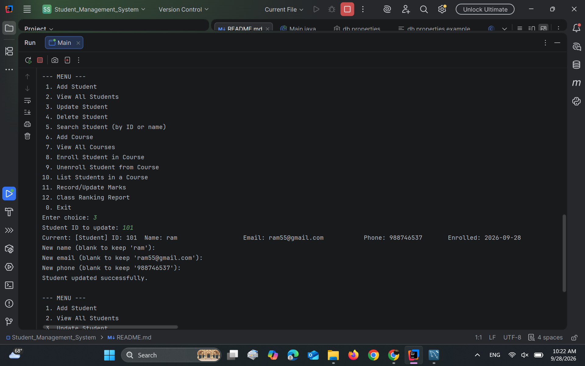

# Student Management System

A terminal-based Java application for managing student records, course
enrollment, and academic performance for an institution. Data is stored
persistently in a MySQL database via JDBC — nothing is lost when the
program exits.

## Features Implemented

- Add, view, update, and delete student records (name, ID, email, phone).
- Add courses and enroll/unenroll students in them.
- Search students by ID or by (partial) name.
- List all students enrolled in a given course.
- Record and update marks for a student in a course.
- Class ranking report: all students sorted by average marks, descending.
- Menu-driven console interface with input validation (rejects non-numeric
  input where a number is expected, rejects empty required fields).
- Meaningful handling of `SQLException` and two custom checked exceptions
  (`RecordNotFoundException`, `DuplicateRecordException`) instead of raw
  stack traces.


## Requirements

Before running the project, make sure you have:

- Java JDK 17 or later
- MySQL Server
- IntelliJ IDEA
- Maven
- Git

## Technologies / Libraries Used


- Java
- Maven
- MySQL
- JDBC
- IntelliJ IDEA
- Git & GitHub

## Project Structure

```
src/main/java/org/example/
├── Main.java                 # menu-driven console entry point
├── model/                    # Person (abstract), Student, Instructor, Course, Enrollment
├── exception/                # RecordNotFoundException, DuplicateRecordException
├── dao/                      # StudentDAO, CourseDAO, EnrollmentDAO (JDBC CRUD)
├── service/                  # StudentService, CourseService (business logic + collections)
└── util/                     # DBConnectionManager, InputValidator
src/main/resources/
└── db.properties.example     # copy to db.properties and fill in your credentials
schema.sql                    # creates the database and all tables
```

### OOP design
`Person` is an abstract class extended by `Student` and `Instructor`
(polymorphism via overridden `displayInfo()`/`getRole()`). All model
fields are private with public getters/setters (encapsulation).

### Collections Framework
- `ArrayList` (via `List`) for ordered student/course results.
- `HashMap` for O(1) ID → Student lookups in `StudentService`.
- `TreeMap` for courses ordered by course code.
- `Comparable`/`Comparator` + sorting for the class ranking report.

### JDBC
All SQL goes through `PreparedStatement`; every `Connection`/`Statement`/
`ResultSet` is opened in try-with-resources. Credentials are **not**
hard-coded — see the setup section below.

## Database Setup

1. Make sure MySQL is running locally (or update the URL for a remote server).
2. Run the schema script to create the database and tables:
   ```bash
   mysql -u root -p < schema.sql
   ```
   This creates the `student_management_system` database with three
   tables: `students`, `courses`, and `enrollments`.

3. Configure your credentials — **do not** edit code, edit config instead:
   ```bash
   cd src/main/resources
   cp db.properties.example db.properties
   ```
   Then edit `db.properties` with your real MySQL username/password.
   `db.properties` is listed in `.gitignore` so it never gets committed.

   Alternatively, set environment variables instead of using the file:
   ```bash
   export DB_URL=jdbc:mysql://localhost:3306/student_management_system
   export DB_USER=root
   export DB_PASSWORD=your_password
   ```

## Setup and Run Instructions

Requires Maven and a JDK 17+.

```bash
# 1. Clone and enter the project
git clone <your-repo-url>
cd Student_Management_System

# 2. Set up the database (see above)
mysql -u root -p < schema.sql
cp src/main/resources/db.properties.example src/main/resources/db.properties
# edit db.properties with your MySQL password

# 3. Build
mvn clean package

# 4. Run
mvn exec:java
# or, using the runnable jar produced by the shade plugin:
java -jar target/Student_Management_System-1.0-SNAPSHOT.jar
```

## Screenshots
main menu 


Adding the students 



updating the students



## Database Setup

Create a MySQL database.
Open the schema.sql file.
Run the SQL commands in MySQL.
Configure the database connection in db.properties.
Build and run the project.


## How to Run

1. Clone the repository.
2. Open the project in IntelliJ IDEA.
3. Make sure MySQL is running.
4. Configure the database settings.
5. Run `Main.java`.

## Git Workflow

--..bash
--git add .
--git commit -m "Describe your changes"
--git push

## Known Limitations

- No authentication/login mode (admin vs. student view) — listed as a
  stretch goal, not implemented.
- No attendance tracking module.
- No export-to-CSV/TXT feature.
